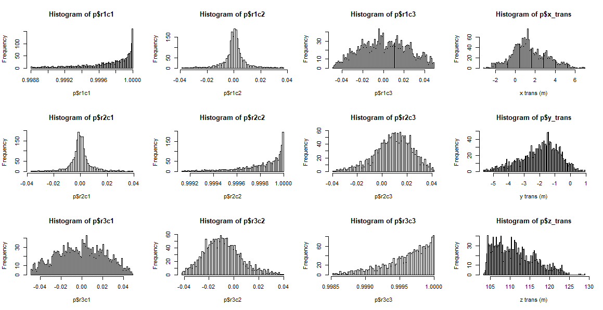
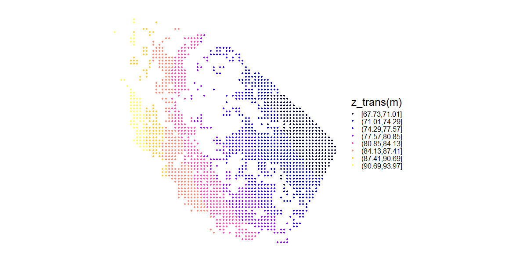
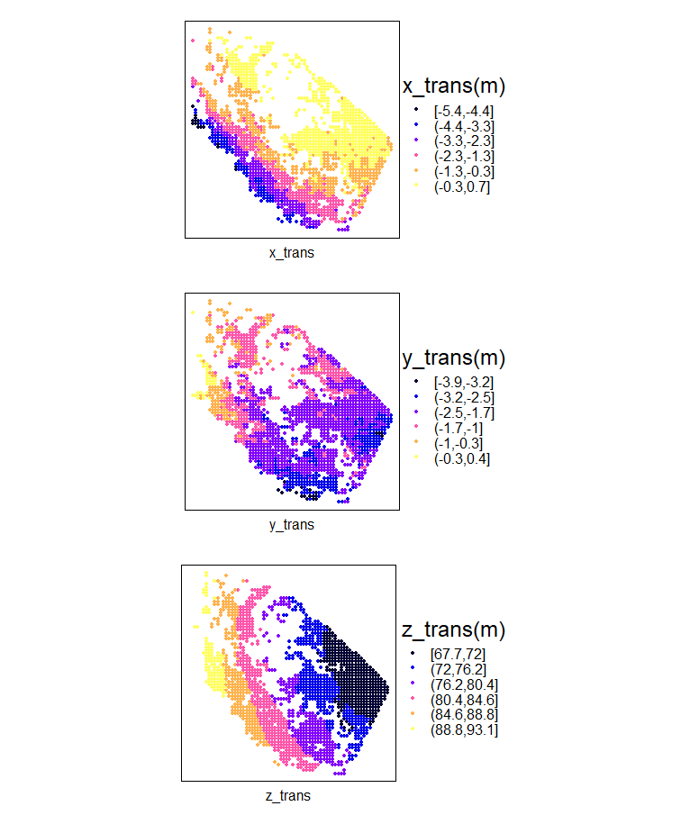
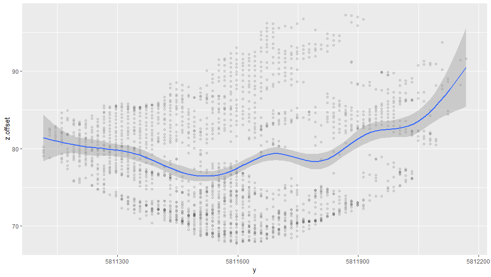
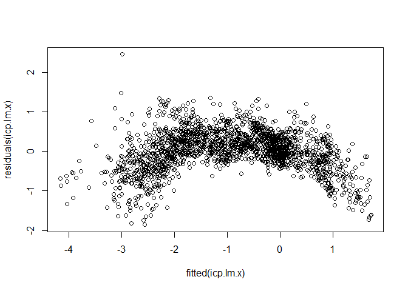
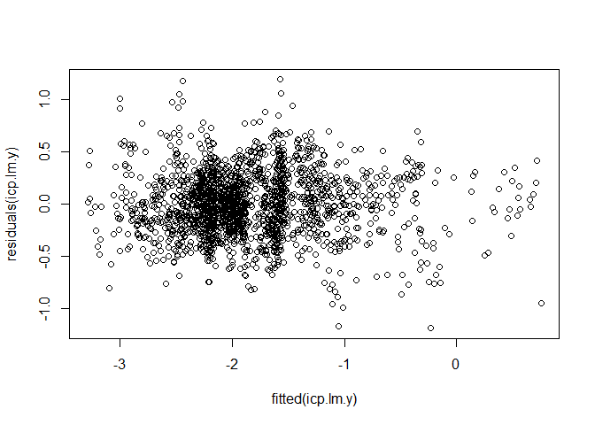
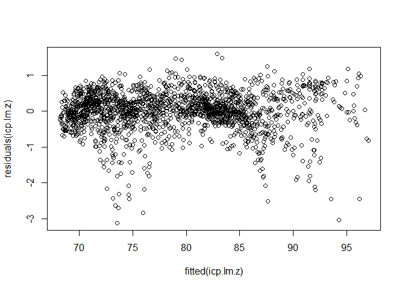
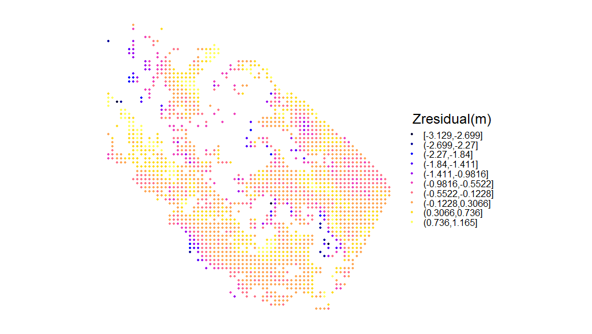
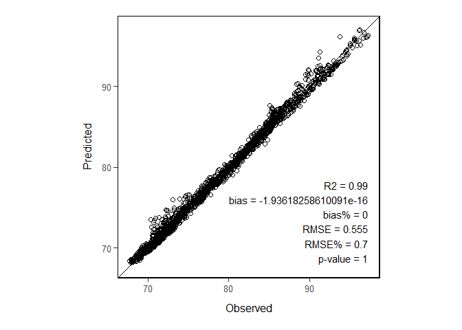

ICP Visualization
================
Alex Graham
July 15, 2019

 

------------------------------------------------------------------------

#### Overview

This script serves to visualize and filter the ICP observation points which will be input to the model development (ICP\_modelling). A series of filtering criteria can be set here. The points will be written out to be used in ICP\_modelling.

``` r
# install.packages("rgdal")
# install.packages("sp")
# install.packages("raster")
# install.packages("rgeos")
# install.packages("ggplot2")
# install.packages("spatial")
# install.packages("polynom")
# install.packages("lidR")
# install.packages("grid")
# install.packages("lattice")
# install.packages("gridExtra")
# install.packages("ggplot2")
# install.packages("gtable")
# install.packages("doParallel")
# install.packages("foreach")
# install.packages("rlas")
# install.packages("lidR")
# install.packages("tidyverse")
# install.packages("dplyr")
# install.packages("tictoc")

library(rgdal)
library(sp)
library(raster)
library(rgeos)
library(ggplot2)
library(spatial)
library(polynom)
library(lidR)
library(grid)
library(lattice)
library(gridExtra)
library(ggplot2)
library(gtable)
library(doParallel)
library(foreach)
library(rlas)
library(lidR)
library(tidyverse)
library(dplyr)
library(tictoc)
library(sf)
```

Project coordinate system (proj4text)

``` r
crs = "+proj=utm +zone=11 +ellps=GRS80 +datum=NAD83 +units=m +no_defs "
```

 
-

#### Parse ICP observation points data

 

Read the csv created as a result of ICP\_moving\_window.R

The csv should contain columns:

*i, isnull, coverage, ICP, x, y, RMS, r1c1, r2c1, r3c1, r1c2, r2c2, r3c2, r1c3, r2c3, r3c3, r1c4, r2c4, r3c4*

Where 'r' and 'c' refer to row and column of the ICP transformation matrix

``` r
# points.f = paste0("<path to the csv file of ICP observation points created using ICP_moving_window.R>")
points.f = "data/ICP_observations/AFRF_ALPHA_step_15_win_50_icp_moving_window_log.csv"
points.df = read.csv(points.f, header=T, stringsAsFactors = F)
```

 

Gather all points where ICP was run and therefore RMS is not NA

``` r
# store as a seperate variable (pts) incase we want to see these points
pts = subset(points.df, ICP == T & !is.na(RMS))
# assign pts as p.  p becomes the the points of interest for remaining analysis
p = pts
```

 

Make sure that certain columns are treated as numeric and rename translational columns

``` r
# these are columns with numeric values from the ICP operation
numcols = c(3, 5:19)
p[,numcols] = apply(p[,numcols], 2, function(x) as.numeric(as.character(x)));
# change the names of the columns associated with the translational transfoamtion values (r1c4, r2c4, and r3c4)
names(p)[17:19] = c('x_trans', 'y_trans', 'z_trans')
```

 

Make the points table into SpatialPointsDataFrame

``` r
p = SpatialPointsDataFrame(p[,5:6], p)
proj4string(p) = crs
# optional writing to shapefile
# writeOGR(p, "D:/JOE_RAKOFSKY/all_points.shp",
#          layer = basename(points.f),
#          driver = 'ESRI Shapefile',
#          overwrite_layer = T)
```

 

Optionally, points can be masked at this stage by an external shapefile

``` r
mask_layer.f = "D:/ICP/mask_layers/mask.shp"
mask_layer = readOGR(mask_layer.f)

crs(mask_layer) = crs(p)
p_masked = p[mask_layer,]

p = p_masked

# option to write out masked points
# writeOGR(p_masked, "D:/ICP/points/all_points_masked.shp",
#          layer = 'p_masked',
#           driver = 'ESRI Shapefile',
#          overwrite_layer = T)
```

 

------------------------------------------------------------------------

#### Filter points

 

Quantile threhsolds are used below to filter points based on ICP estimated rotation, RMS and translation. Trial and error may be needed to determine optimal threshold values. The values used below were derived from UAS-DAP point cloud matching with ALS cloud over AFRF Gavin Lake (near Williams Lake).

*thr.rotation* is used to filter values in the diagonal of the 3x3 rotation matrix (r1c1, r2c2, r3c3) and is a quantile value where only points greater than the threshold are selected. Values nearest 1 on the diagonal have minimal rotation so we use this to filter the results. There is a tradeoff between having sufficient number of points to have wall-to-wall coverage for the modelling stage and incluiding accurate matching observations.

*thr.RMS* is used for isolating RMS values below the quantile threhsold

*thr.xtrans*, *thr.ytrans*, and *thr.ztrans* are filtered in the same manner using a two-tailed cutoff with the *alpha* value as the quantile. Filtering should not be performed on the translation vectors that are to be modelled. For example, if we want to produce a Z translation model, we can comment out the filtering for *thr.ztrans* as is done below.

``` r
thr.rotation = 0.25
thr.RMS = 0.75
alpha = 0.01

tail_min = alpha
tail_max = 1 - alpha

thr.xtrans.min = tail_min
thr.ytrans.min = tail_min
thr.ztrans.min = tail_min

thr.xtrans.max = tail_max
thr.ytrans.max = tail_max
thr.ztrans.max = tail_max

# perform the subsetting of valid icp points
p = subset(p, r1c1 > quantile(r1c1, thr.rotation) &
             r2c2 > quantile(r2c2, thr.rotation) &
             r3c3 > quantile(r3c3, thr.rotation) &
             # filter for RMS values
             RMS < quantile(RMS, thr.RMS) &
             # filter the x and y translation low values
             x_trans > quantile(x_trans, thr.xtrans.min) &
             y_trans > quantile(y_trans, thr.ytrans.min) &
             # z_trans > quantile(z_trans, thr.ztrans.min) &
             # filter the x and y translation high values
             x_trans < quantile(x_trans, thr.xtrans.max) &
             y_trans < quantile(y_trans, thr.ytrans.max))
             # z_trans < quantile(z_trans, thr.ztrans.max))
```

 

------------------------------------------------------------------------

#### Histogram generation

 

Produce histograms of the transforamtion vlaues created from ICP. Arrange histograms 4 x 4 matrix mimicking the format of the original ICP output matrix

``` r
par(mfrow = c(3,4))
# number of bins
b = 100
# row 1 of matrix
hist(p$r1c1, b)
hist(p$r1c2, b)
hist(p$r1c3, b)
hist(p$x_trans, b, xlab = 'x trans (m)')
# row 2
hist(p$r2c1, b)
hist(p$r2c2, b)
hist(p$r2c3, b)
hist(p$y_trans, b, xlab = 'y trans (m)')
# row 3
hist(p$r3c1, b)
hist(p$r3c2, b)
hist(p$r3c3, b)
hist(p$z_trans, b,  xlab = 'z trans (m)')
```

 



**Figure 1.** *Example histograms of ICP estimated shift values for area ALPHA in AFRF block.*  

 

------------------------------------------------------------------------

#### Spatial plots of points

 

``` r
# spatial plot of matrix results
# use trans = 'x_trans' or 'y_trans' for other directions
trans = 'z_trans'
n = abs(round((max(p[[trans]]) - min(p[[trans]]))/9, 4))
cuts.p = seq(min(p[[trans]]), max(p[[trans]]), n)
cuts.p = round(cuts.p,4)
trellis.par.set(axis.line=list(col=NA)) 
sp::spplot(p, zcol = trans, cuts = cuts.p, key.space = 'right', cex = 0.5,
           auto.key = list(title = paste0(trans, '(m)')))

# option to write the shp file of the subset of points
f = gsub('.csv', '.shp', basename(points.f))
writeOGR(p, paste("D:/JOE_RAKOFSKY/shp/", f, sep = ''), layer = f, driver = "ESRI Shapefile", overwrite_layer = T)
```

 



**Figure 2.** *Example spatial plot of ICP estimated z-shift values for area ALPHA in AFRF.*  

 

------------------------------------------------------------------------

#### Make spatial plots for each direction (x, y, z) in a loop

 

``` r
# empty list to populate with spplot objects
plots = list()
i = 0
for (trans in c('x_trans', 'y_trans', 'z_trans')){
  i = i+1

  # run this block alone for
  n = abs(round((max(p[[trans]]) - min(p[[trans]]))/7, 2))
  cuts.p = seq(min(p[[trans]]), max(p[[trans]]), n)
  cuts.p = round(cuts.p,1)
  plot = spplot(p, zcol = trans, cuts = cuts.p, key.space = 'right', cex = 0.5, xlab = trans,
                auto.key = list(title = paste0(trans, '(m)')))

  plots[[i]] = plot
}
# arrange the plots for display
# **note**  sometimes the plot only draws properly when the following line is run seperately from the loop
do.call(grid.arrange, plots)
```



**Figure 3.** *Spatial plots of shift estimates for x, y, and z directions for ALPHA block of AFRF*  

 

------------------------------------------------------------------------

#### Shift modelling

 

Define variables which hold the 2D location of points, as well as the estiamte shifts for each direction (x, y and z)

``` r
# the 2d coordinates of each point
x = p$x
y = p$y
# get the ICP translation columns
x.offset = p$x_trans
y.offset = p$y_trans
z.offset = p$z_trans
```

 

Quick 2D plotting

``` r
# change the y argument and model for X, Y or Z offsets
# plot the shifts as a function of x or y direction
ggp = ggplot()
ggp = ggp + geom_point(aes(x = y, y = z.offset), alpha = 0.1)
ggp = ggp + geom_smooth(aes(x = y, y = z.offset))
ggp
```

 



**Figure 4.** *Quick plot of AFRF ALPHA, Z trans vs UTM Y*  

 

------------------------------------------------------------------------

#### Polynomial model generation

 

The following section generates a series of candidate polynomial models to predict the X Y and Z offsets across the extent. The code below generates a series of polynomial models for each direction and populates a table of the results. The 'best model' is determined by the highest adjusted R squared value.  

First, define a range of polynomial factors to test for modelling across space. The lm() function used with poly() produces errors for polynomial orders greater than 25, therefore, orders of up to 20 were tested as is done below.

``` r
powersX = (seq(1,20,1))
powersY = (seq(1,20,1))
```

 

The following creates an empty table to be populated with model Rsq and adjRsq values for each polymonial factor tested. *n* is the number of possible models to be generated. Models are generated for x, y and z directions.

``` r
n = length(powersX)*length(powersY)*3
# build empty table
models.table = data.frame(Shift = character(n),
                          pwrX=numeric(n), 
                          pwrY=numeric(n), 
                          Rsq = numeric(n),
                          adjRsq = numeric(n),
                          AIC = numeric(n),
                          stringsAsFactors=FALSE) 
```

 

Use a loop to generate the various combinations of polynomial models. lm() summary objects are stored as well as anova and AIC values. *i* is used to index the models.table and populate it

``` r
i = 0
# switch for 'raw' argument in poly - see ?poly
raw.sw = F
for (pwrX in powersX){
  for (pwrY in powersY){
    i = i+1
    # create models with the current powers to predict the offset values from ICP
    icp.lm.x = lm(x.offset ~ poly(x, pwrX, raw= raw.sw) + poly(y, pwrY, raw= raw.sw))
    icp.lm.y = lm(y.offset ~ poly(x, pwrX, raw= raw.sw) + poly(y, pwrY, raw= raw.sw))
    icp.lm.z = lm(z.offset ~ poly(x, pwrX, raw= raw.sw) + poly(y, pwrY, raw= raw.sw))
    # model summaries
    sx = summary(icp.lm.x)
    sy = summary(icp.lm.y)
    sz = summary(icp.lm.z)
    # ANOVA of each model
    anova(anova.x <- icp.lm.x)
    anova(anova.y <- icp.lm.y)
    anova(anova.z <- icp.lm.z)
    # get AIC of each ANOVA
    AIC.x = AIC(anova.x)
    AIC.y = AIC(anova.y)
    AIC.z = AIC(anova.z)
    # make row for each model 
    rowX = list('X', pwrX, pwrY, sx$r.squared, sx$adj.r.squared, AIC.x)
    rowY = list('Y', pwrX, pwrY, sy$r.squared, sy$adj.r.squared, AIC.y)
    rowZ = list('Z', pwrX, pwrY, sz$r.squared, sz$adj.r.squared, AIC.z)
    # put rows in to the table
    models.table[i,] = rowX
    models.table[i+1,] = rowY
    models.table[i+2,] = rowZ
    i = i+2
  }
}
```

 

Create some objects which hold subset of the *models.table*

``` r
# subset the models for each 3D direction
models.X = subset(models.table, Shift == 'X')
models.Y = subset(models.table, Shift == 'Y')
models.Z = subset(models.table, Shift == 'Z')
# get the model with highest adjRsq
best.model.X = subset(models.X, adjRsq == max(adjRsq))
best.model.X = subset(best.model.X, pwrX == min(pwrX) & pwrY == min(pwrY))
best.model.Y = subset(models.Y, adjRsq == max(adjRsq))
best.model.Y = subset(best.model.Y, pwrX == min(pwrX) & pwrY == min(pwrY))
best.model.Z = subset(models.Z, adjRsq == max(adjRsq))
best.model.Z = subset(best.model.Z, pwrX == min(pwrX) & pwrY == min(pwrY))
```

 

Results of the best models for each shift direction (x, y and z)

``` r
best.model.X
```

    ##      Shift pwrX pwrY       Rsq    adjRsq      AIC
    ## 1192     X   20   18 0.8548204 0.8517487 2794.034

``` r
best.model.Y
```

    ##      Shift pwrX pwrY       Rsq    adjRsq     AIC
    ## 1190     Y   20   17 0.8111567 0.8072684 923.068

``` r
best.model.Z
```

    ##     Shift pwrX pwrY       Rsq    adjRsq      AIC
    ## 951     Z   16   17 0.9935072 0.9933883 3113.966

 

Define the final model based on highest adjusted R squared value.

``` r
icp.lm.x = lm(x.offset ~ poly(x, best.model.X$pwrX, raw= raw.sw) + poly(y, best.model.X$pwrY, raw= raw.sw))
icp.lm.y = lm(y.offset ~ poly(x, best.model.Y$pwrX, raw= raw.sw) + poly(y, best.model.Y$pwrY, raw= raw.sw))
icp.lm.z = lm(z.offset ~ poly(x, best.model.Z$pwrX, raw= raw.sw) + poly(y, best.model.Z$pwrY, raw= raw.sw))
```

 

Model results (rsquare and adjusted rsquared).

``` r
# model summaries
summary(icp.lm.x)[c("r.squared", "adj.r.squared")]
```

    ## $r.squared
    ## [1] 0.8548204
    ## 
    ## $adj.r.squared
    ## [1] 0.8517487

``` r
summary(icp.lm.y)[c("r.squared", "adj.r.squared")]
```

    ## $r.squared
    ## [1] 0.8111567
    ## 
    ## $adj.r.squared
    ## [1] 0.8072684

``` r
summary(icp.lm.z)[c("r.squared", "adj.r.squared")]
```

    ## $r.squared
    ## [1] 0.9935072
    ## 
    ## $adj.r.squared
    ## [1] 0.9933883

 

Standard deviation of the model residuals.

``` r
# sd of residuals
sd(residuals(icp.lm.x))
```

    ## [1] 0.5070492

``` r
sd(residuals(icp.lm.y))
```

    ## [1] 0.3047077

``` r
sd(residuals(icp.lm.z))
```

    ## [1] 0.5547446

 

Simple plots to check the residuals vs fitted.

``` r
plot(fitted(icp.lm.x), residuals(icp.lm.x))
```



``` r
plot(fitted(icp.lm.y), residuals(icp.lm.y))
```



``` r
plot(fitted(icp.lm.z), residuals(icp.lm.z))
```

  

Get confidence intervals for variables in each model.

``` r
confint(icp.lm.x, level=0.999)
confint(icp.lm.y, level=0.999)
confint(icp.lm.z, level=0.999)
```

 

Calculate RMSE for each model

``` r
RSS.x <- c(crossprod(icp.lm.x$residuals))
MSE.x <- RSS.x / length(icp.lm.x$residuals)
RMSE.x <- sqrt(MSE.x)
RSS.y <- c(crossprod(icp.lm.y$residuals))
MSE.y <- RSS.y / length(icp.lm.y$residuals)
RMSE.y <- sqrt(MSE.y)
RSS.z <- c(crossprod(icp.lm.z$residuals))
MSE.z <- RSS.z / length(icp.lm.z$residuals)
RMSE.z <- sqrt(MSE.z)
```

 

Root-mean-square-error (RMSE) of fitted vs. observed for each model.

``` r
RMSE.x
```

    ## [1] 0.506911

``` r
RMSE.y
```

    ## [1] 0.3046247

``` r
RMSE.z
```

    ## [1] 0.5545934

 

Bind the residuals from the model to the spatial points.

``` r
p = cbind(p, icp.lm.x$residuals)
names(p)[length(names(p))] = 'Xresidual'
p = cbind(p, icp.lm.y$residuals)
names(p)[length(names(p))] = 'Yresidual'
p = cbind(p, icp.lm.z$residuals)
names(p)[length(names(p))] = 'Zresidual'
```

 

Spatial plots of the modelling results

``` r
# use Xresidual or Yresidual for different directions
trans = 'Zresidual'
n = abs(round((max(p[[trans]]) - min(p[[trans]]))/11, 4))
cuts.p = seq(min(p[[trans]]), max(p[[trans]]), n)
cuts.p = round(cuts.p,4)
spplot(p, zcol = trans, cuts = cuts.p, key.space = 'right', cex = 0.5,
 auto.key = list(title = paste0(trans, '(m)')))
```



**Figure 5.** *AFRF ALPHA Z translation model residuals across space*

Option to write out point shapefile with residuals.

``` r
# f = gsub('.csv', '.shp', basename(points.f))
# writeOGR(p, paste("H:/AFRF_ICP/ICP_points/shp/", 'residuals_', f, sep = ''), layer = f, driver = # "ESRI Shapefile", overwrite_layer = T)
# write.csv(p@data,paste("H:/AFRF_ICP/ICP_points/shp/", 'residuals_', basename(points.f), sep = ''))
```

**Plotting 1 to 1 observed vs. predicted**

Import library developed by P. Tompalski

``` r
library(UsefulRFunctions)
```

    ## 
    ## Attaching package: 'UsefulRFunctions'

    ## The following object is masked from 'package:base':
    ## 
    ##     mode

 

Simple function for calculating R squared

``` r
r_square <- function(obs,pred) {
  resid <- obs - pred
  1 - (var(resid, na.rm = TRUE) / var(obs, na.rm = TRUE))
}
```

 

*scatter2()* function for creating 1 to 1 plots

``` r
bw<-UsefulRFunctions:::bw
scatter2 <- function (x, y, R2=T, by = NULL, axisorder = "PO", xlab = "Observed", 
                      ylab = "Predicted", title = NULL, info = T, position = 0, 
                      positionauto = T, lowerlimit = NA, upperlimit = NA, alpha = 1, normality=T,
                      add.reg.line = F, rug = F, label_text = c("n", "bias", "bias%", 
                                                                "RMSE", "RMSE%","p-value")) 
{
  if (!is.null(by)) {
    data <- data.frame(x = x, y = y, by = by)
    pts <- ggplot2::geom_point(shape = 1, size = 2, alpha = alpha, 
                               ggplot2::aes(colour = by))
  }
  else {
    data <- data.frame(x = x, y = y)
    pts <- ggplot2::geom_point(shape = 1, size = 2, alpha = alpha)
  }
  
  if(normality == T) {
    d <- UsefulRFunctions::calc.error(reference = data$x, estimate = data$y)
  } else {
    d <- UsefulRFunctions::calc.error(reference = data$x, estimate = data$y, dist.normal = F)
  }
  
  label <- paste(#label_text[1], " = ", d$count, "\n", 
    label_text[2], " = ", round(d$bias, 100), "\n", 
    label_text[3], " = ", round(d$bias_perc, 2), "\n", 
    label_text[4], " = ", round(d$RMSE, 3), "\n", 
    label_text[5], " = ", round(d$RMSE_perc, 2), "\n", 
    label_text[6], " = ", round(d$p_val, 3),
    sep = "")
  
  
  if(R2 == T) {
    R2 <- r_square(obs = x, pred = y)
    label <- paste0("R2 = ", round(R2,2),
                    "\n",
                    label
    )
  } else if (R2=="cor") {
    R2 <- cor(x,y)^2
    label <- paste0("R2 = ", round(R2,2),
                    "\n",
                    label
    )
  } else if (is.numeric(R2)) {
    label <- paste0("R2 = ", round(R2,2),
                    "\n",
                    label
    )
  }
  
  # if (!is.null(R2)) {
  #   label <- paste0("R2 = ", round(R2,2),
  #                  "\n",
  #                  label
  #                  )
  # }
  # 
  
  
  if (axisorder == "OP") {
    data <- data.frame(x = data$y, y = data$x)
    x_lab_copy <- xlab
    xlab = ylab
    ylab = x_lab_copy
  }
  if (is.na(lowerlimit)) 
    lowerlimit <- min(data[c("x", "y")], na.rm = T)
  if (is.na(upperlimit)) 
    upperlimit <- max(data[c("x", "y")], na.rm = T)
  if (position != 0) 
    positionauto <- F
  if (positionauto == T) {
    if (is.finite(d$bias_perc) & d$bias_perc < -20) 
      position <- 1
  }
  if (position == 0) {
    ann_x <- upperlimit
    ann_y <- -Inf
    ann_hjust <- 1
    ann_vjust <- -0.2
  }
  if (position == 1) {
    ann_x <- lowerlimit
    ann_y <- upperlimit
    ann_hjust <- 0
    ann_vjust <- 0.9
  }
  if (info == T) {
    ann <- ggplot2::annotate("text", x = ann_x, y = ann_y, 
                             label = label, hjust = ann_hjust, vjust = ann_vjust)
  }
  else {
    ann <- bw
  }
  if (rug == T) {
    addrug <- ggplot2::geom_rug(alpha = 0.2)
  }
  else {
    addrug <- bw
  }
  if (add.reg.line == T) {
    reg.line <- ggplot2::geom_smooth(se = FALSE, method = "lm", 
                                     colour = "red")
  }
  else {
    reg.line <- bw
  }
  plot <- ggplot2::ggplot(data = data, ggplot2::aes(x = x, 
                                                    y = y)) + pts + ggplot2::xlab(xlab) + ggplot2::ylab(ylab) + 
    ggplot2::ggtitle(title) + ggplot2::xlim(lowerlimit, upperlimit) + 
    ggplot2::ylim(lowerlimit, upperlimit) + ggplot2::geom_abline(intercept = 0, 
                                                                 slope = 1) + ann + ggplot2::theme(legend.position = "bottom") + 
    ggplot2::coord_equal(ratio = 1) + addrug + reg.line + 
    UsefulRFunctions:::bw
  return(plot)
}
```

 

Example of using the 1 to 1 scatter plot

``` r
scatter2(x = z.offset, y = icp.lm.z$fitted.values)
```

  

Once the modelling results are adequate, save them as Rdata objects. These will be used in the unwarping process with *ICP\_unwarp*.

``` r
saveRDS(icp.lm.x, file = "data/lm/icp_lm_x.rds")
saveRDS(icp.lm.y, file = "data/lm/icp_lm_y.rds")
saveRDS(icp.lm.z, file = "data/lm/icp_lm_z.rds")
```
